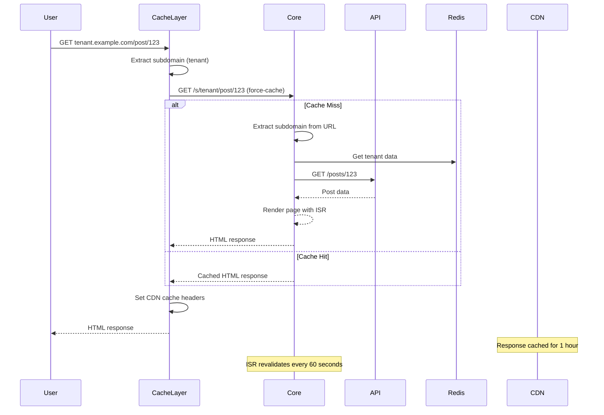

# Durable ISR Architecture

A three-app Next.js system that provides durable ISR caching for multi-tenant platforms on Vercel. The cache layer survives Core app deployments, enabling independent scaling and true cache durability.

## Components

### 1. Core (`apps/core`)

- Renders pages, manages subdomains, fetches from API
- ISR revalidation: 60 seconds

### 2. Cache Layer (`apps/cache-layer`)

- Proxies to Core with `force-cache`
- ISR revalidation: 1 hour
- Survives Core deployments

### 3. API (`apps/api`)

- Content API for Core app
- Used to control failure scenarios; this can be implemented with any existing API

## System Architecture Diagram

```mermaid
graph TB
    subgraph "User Requests"
        U1[User Request<br/>tenant.example.com]
        U2[Admin Request<br/>example.com/admin]
    end

    subgraph "Cache Layer (Port 3000)"
        CL[Cache Layer App<br/>Next.js 15.5.2]
        CLM[Middleware<br/>Subdomain Detection]
        CLR[Route Handler<br/>[...slug]/route.ts]
    end

    subgraph "Core App (Port 3001)"
        CA[Core App<br/>Next.js 15.3.2]
        CAM[Middleware<br/>Subdomain Routing]
        CAR[Page Components<br/>ISR enabled]
        CARedis[(Redis<br/>Tenant Data)]
    end

    subgraph "API App (Port 3002)"
        API[API App<br/>Next.js 15.5.2]
        APIR[API Routes<br/>/posts, /authors]
        APIData[(Static Data<br/>JSON files)]
    end

    subgraph "Vercel Deployment"
        VCDN[Vercel CDN<br/>Edge Caching]
        VCore[Core Deployment<br/>core.vercel.app]
        VCache[Cache Deployment<br/>cache.vercel.app]
        VAPI[API Deployment<br/>api.vercel.app]
    end

    U1 --> CL
    U2 --> CA
    CL --> CLM
    CLM --> CLR
    CLR --> CA
    CA --> CAM
    CAM --> CAR
    CAR --> API
    API --> APIR
    APIR --> APIData
    CAR --> CARedis

    CL -.-> VCDN
    CA -.-> VCore
    API -.-> VAPI
    CL -.-> VCache
```

## Data Flow Diagram



## Multi-Tenant Routing

Subdomain-based routing: `tenant.example.com` → `/s/tenant` → tenant-specific content

**Environments**:

- Local: `tenant.localhost:3000`
- Production: `tenant.example.com`
- Vercel Preview: `tenant---branch-name.vercel.app`

## ISR Strategy

**Core**: 60s revalidation, fetches from API
**Cache Layer**: 1h revalidation, `force-cache` to Core, CDN headers
**Durability**: Cache survives Core deployments

## Vercel Deployment

**Environment Variables**:

- Core: `API_HOST`, `CACHE_LAYER_HOST`, Redis credentials
- Cache Layer: `CORE_HOST`, `API_HOST`
- API: `CORE_HOST`, `CACHE_LAYER_HOST`

**Deployment**: Independent apps, custom domains, CDN integration

## Benefits

**Durable Cache**: Survives Core deployments, reduces cold starts
**Multi-Tenant**: Subdomain isolation, shared infrastructure
**Independent Scaling**: Each service scales separately

## Implementation

**Cache Headers**:

```typescript
// Cache Layer
pageResponse.headers.set("vercel-cdn-cache-control", "public, max-age=3600");

// Core App
export const revalidate = 60;
```

**Service Communication**:

```typescript
// Core → API
const posts = await apiClient.getAllPosts();

// Cache Layer → Core
const response = await fetch(`${coreUrl}/${slug.join("/")}`, {
  cache: "force-cache",
});
```

**Tenancy**:

```typescript
// Redis storage
await redis.set(`subdomain:${subdomain}`, { emoji, createdAt });
```
