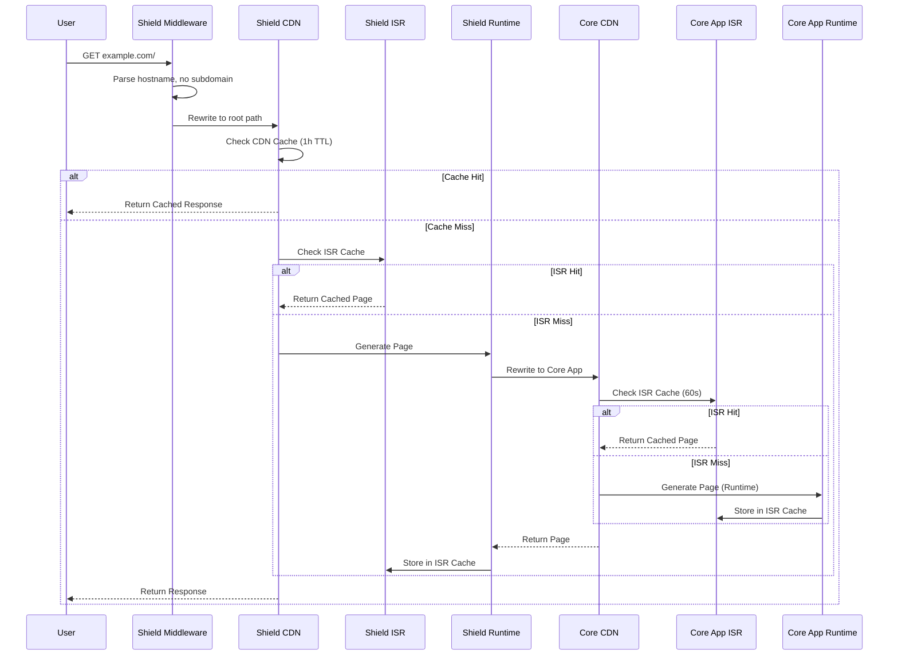
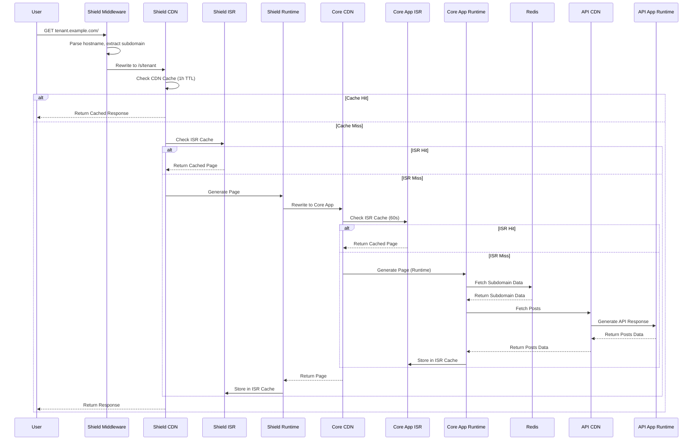
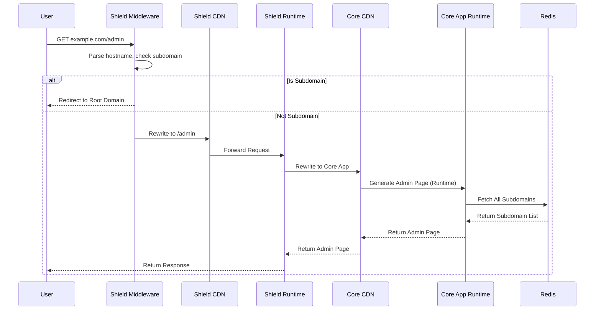
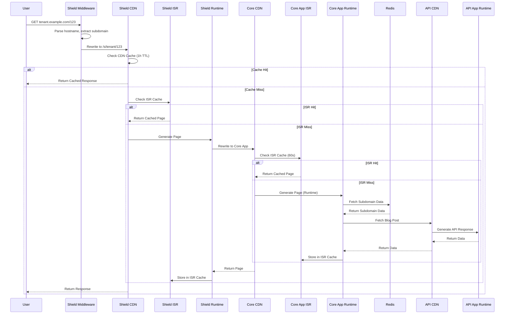

# Request Flow Diagrams

This document shows the request flow for different routes through the durable ISR multi-tenant platform, including cache layers and system boundaries.

## Root Domain (/) - Landing Page

## Subdomain (/) - Tenant Landing Page

## Admin Panel (/admin)

## Blog Post Page (/[slug])

## System Boundaries

Each subsystem indicated here is an independent Next.js project.

### Shield (Port 3000)

- **Vercel CDN**: 1-hour cache for all responses
- **ISR Cache**: 60-second revalidation for dynamic pages
- **Runtime**: Middleware for subdomain detection and routing, proxy to Core App
- **Middleware**: Subdomain extraction, URL rewriting, admin page protection

### Core (Port 3001)

- **Vercel CDN**: Edge caching for static assets
- **ISR Cache**: 60-second revalidation for dynamic pages
- **Runtime**: Page generation, Redis integration, API client
- **External Dependencies**: Redis for subdomain data storage
- **No Middleware**: Pure content generation server

### API App (Port 3002)

- **Runtime**: Simplified API endpoints for posts
- **Endpoints**: `/posts` (get 5 posts) and `/posts/[id]` (get single post)
- **Data Source**: JSON file with in-memory caching
- **Purpose**: Content API for the multi-tenant platform

