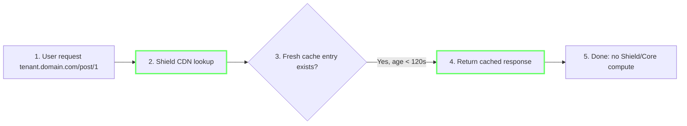
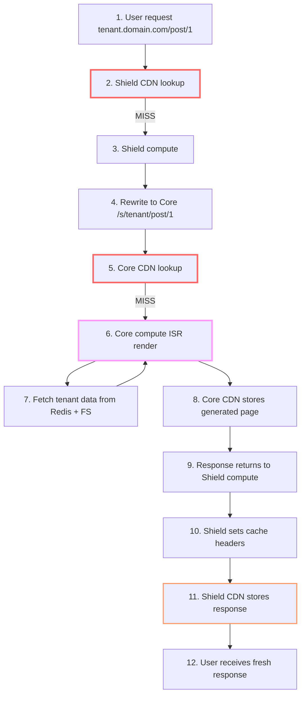
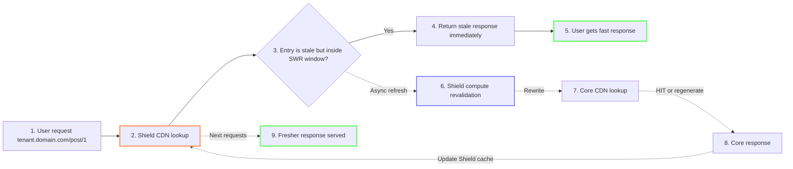
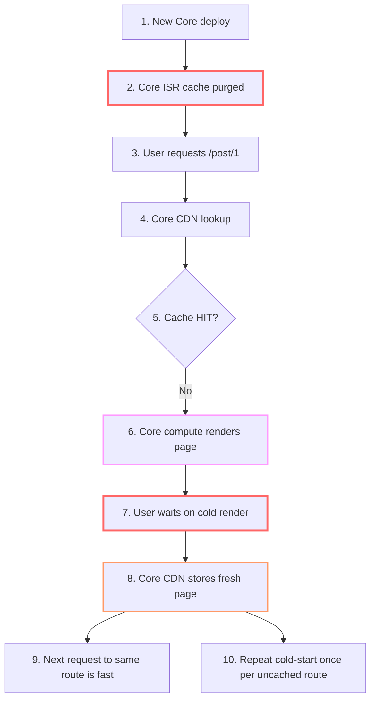
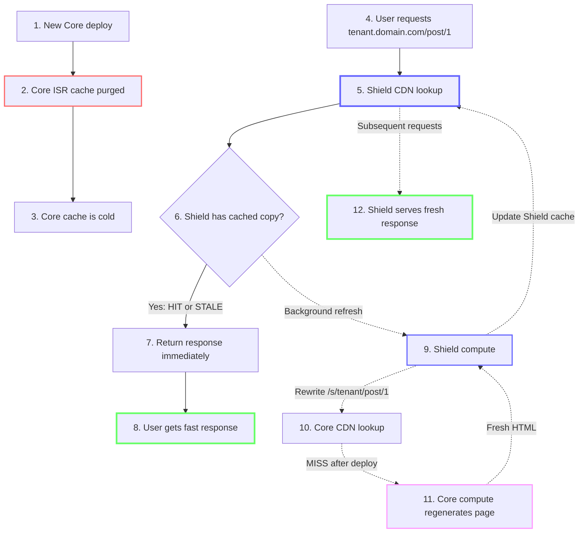
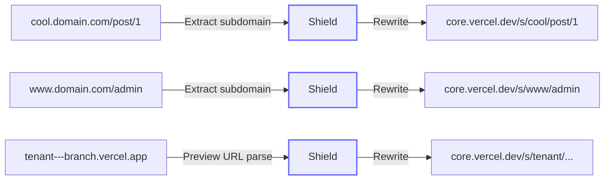

# Shielded ISR Multi-Tenant Architecture

A comprehensive guide to the shielded ISR multi-tenant platform architecture, including system capabilities, request flows, cache strategies, and deployment protection mechanisms.

## Overview

The Shielded ISR Multi-Tenant Platform is a sophisticated architecture that solves the critical problem of cache invalidation during deployments in multi-tenant applications. The system provides:

- **Cache Protection**: Serves cached content while Core app ISR cache rebuilds after deployment
- **Cache Pre-warming**: Enables safe cache warming after deployment
- **Multi-Tenant Support**: Subdomain-based tenant isolation with dynamic routing
- **Deployment Safety**: Prevents slow first requests during critical post-deployment periods

### The Solution

The Shielded ISR architecture introduces a protective cache layer that:

- **Protects During Deployments**: Serves cached static content while Core app rebuilds
- **Enables Safe Pre-warming**: Allows cache warming after deployment with minimal user impact
- **Supports Multi-Tenancy**: Handles subdomain routing with granular cache invalidation

## System Architecture


```mermaid
flowchart LR
    subgraph SH[Shield App]
        direction TB
        SC[Shield CDN Cache]
        SN[Shield Compute]
        SP["Shield purge route"]
        SI["Shield invalidate route"]
    end

    subgraph CO[Core App]
        direction TB
        CC[Core CDN or ISR Cache]
        CN[Core Compute Renderer]
        CI["Core cache delete route"]
    end

    subgraph DA[Data Layer]
        direction TB
        R[Redis tenant config]
        FS[File System content]
    end

    subgraph CL[Client Layer]
        direction TB
        RQ[1. Request tenant.domain.com/path]
        U[User Browser]
        CQ[Client cache]
        RQ --> U
    end

    subgraph CP[Control Events]
        direction TB
        DEP[Core deployment]
        MUT[Content mutation event]
        ORC[Invalidation worker]
    end

    U -->|2. Request reaches Shield CDN| SC
    SC -->|2a. HIT| U
    SC -->|2b. MISS or STALE| SN
    SN -->|3. Rewrite to Core /s/tenant/path| CC
    CC -->|4a. HIT| SN
    CC -->|4b. MISS| CN
    CN -->|5. Load tenant and page data| R
    CN -->|5. Load content| FS
    CN -->|6. Generated page| CC
    CC -->|7. Response to Shield| SN
    SN -->|8. Set s-maxage=120 and swr=1 year| SC
    SC -->|9. Return response| U

    MUT -.->|A. Trigger near-atomic sequence| ORC
    ORC -.->|B. Call /api/purge first| SP
    SP -.->|C. Purge client cache by tag| CQ
    ORC -.->|D. Immediately call /api/invalidate| SI
    SI -.->|E. Delete Core tag first| CI
    CI -.->|F. Invalidate Shield tag second| SC

    DEP -.->|G. Core ISR cache reset| CC
    DEP -.->|H. Shield cache remains available| SC

    style SH stroke:#66f,stroke-width:3px
    style SC stroke:#66f,stroke-width:2px
    style SN stroke:#66f,stroke-width:2px
    style SP stroke:#66f,stroke-width:2px
    style SI stroke:#66f,stroke-width:2px
    style CO stroke:#f9f,stroke-width:3px
    style CC stroke:#f9f,stroke-width:2px
    style CN stroke:#f9f,stroke-width:2px
    style CI stroke:#f9f,stroke-width:2px
    style CL stroke:#f96,stroke-width:2px
    style CQ stroke:#f96,stroke-width:3px
    style R stroke:#6f6,stroke-width:2px
    style FS stroke:#6f6,stroke-width:2px
    style CP stroke:#f96,stroke-width:2px
```

Solid arrows are the request/data plane. Dashed arrows are deployment and invalidation control flows.

Critical ordering: call `/api/purge` first, then `/api/invalidate` immediately after (near-atomically) to avoid clients re-reading stale entries between operations.

### Shield

**Purpose**: Provides cache protection and routing for the multi-tenant platform

**Components**:

- **Vercel CDN Cache**: `s-maxage=120`, `stale-while-revalidate=31556952` (~1 year)
- **Compute**: Subdomain extraction, rewrite routing, cache invalidation API

### Core

**Purpose**: Generates pages and handles multi-tenant content

**Components**:

- **Vercel CDN Cache**: Edge caching for static assets
- **ISR**: `revalidate=3600` (1 hour) for dynamic pages
- **Compute**: Page generation and data access
- **Data Access**: Direct access to Redis and file system

#### Data Layer

**Components**:

- **Redis**: Subdomain data storage and configuration
- **File System**: Blog posts and static content

## Request Flow

Use this section to reason about what happens per request:

- **HIT**: Shield serves immediately, no compute.
- **MISS**: Request traverses Shield -> Core -> data layer, then both caches fill.
- **STALE**: Shield serves stale immediately, then refreshes in the background.

### 1) Shield HIT (Fast Path)


```mermaid
flowchart LR
    A[1. User request tenant.domain.com/post/1] --> B[2. Shield CDN lookup]
    B --> C{3. Fresh cache entry exists?}
    C -->|Yes, age < 120s| D[4. Return cached response]
    D --> E[5. Done: no Shield/Core compute]

    style B stroke:#6f6,stroke-width:3px
    style D stroke:#6f6,stroke-width:3px
```

Shield CDN responds directly. No compute runs in either app.

### 2) Shield MISS + Core MISS (Cold Start)


```mermaid
flowchart TD
    A[1. User request tenant.domain.com/post/1] --> B[2. Shield CDN lookup]
    B -->|MISS| C[3. Shield compute]
    C --> D[4. Rewrite to Core /s/tenant/post/1]
    D --> E[5. Core CDN lookup]
    E -->|MISS| F[6. Core compute ISR render]
    F --> G[7. Fetch tenant data from Redis + FS]
    G --> F
    F --> H[8. Core CDN stores generated page]
    H --> I[9. Response returns to Shield compute]
    I --> J[10. Shield sets cache headers]
    J --> K[11. Shield CDN stores response]
    K --> L[12. User receives fresh response]

    style B stroke:#f66,stroke-width:3px
    style E stroke:#f66,stroke-width:3px
    style F stroke:#f9f,stroke-width:3px
    style K stroke:#f96,stroke-width:2px
```

Both caches miss. Core generates the page, and the response is cached at both layers on the way back.

### 3) Shield Stale-While-Revalidate (After Shield TTL)


```mermaid
flowchart LR
    A[1. User request tenant.domain.com/post/1] --> B[2. Shield CDN lookup]
    B --> C{3. Entry is stale but inside SWR window?}
    C -->|Yes| D[4. Return stale response immediately]
    D --> E[5. User gets fast response]

    C -.->|Async refresh| F[6. Shield compute revalidation]
    F -.->|Rewrite| G[7. Core CDN lookup]
    G -.->|HIT or regenerate| H[8. Core response]
    H -.->|Update Shield cache| B
    B -.->|Next requests| I[9. Fresher response served]

    style B stroke:#f96,stroke-width:3px
    style F stroke:#66f,stroke-width:2px
    style E stroke:#6f6,stroke-width:3px
    style I stroke:#6f6,stroke-width:3px
```

User gets the stale response instantly. Shield revalidates in the background. The ~1 year SWR window means stale content is almost always available.

## Deployment Protection

This is the core value of the shield pattern: **Core deployments don't cause cold starts for users.**

### Mental Model

1. A Core deploy clears Core ISR cache.
2. Shield cache is independent, so it survives the deploy.
3. User traffic is served from Shield immediately.
4. Shield refreshes Core in the background and updates itself with fresh content.

### Without Shield (Normal ISR)


```mermaid
flowchart TD
    A[1. New Core deploy] --> B[2. Core ISR cache purged]
    B --> C[3. User requests /post/1]
    C --> D[4. Core CDN lookup]
    D --> E{5. Cache HIT?}
    E -->|No| F[6. Core compute renders page]
    F --> G[7. User waits on cold render]
    G --> H[8. Core CDN stores fresh page]
    H --> I[9. Next request to same route is fast]
    H --> J[10. Repeat cold-start once per uncached route]

    style B stroke:#f66,stroke-width:3px
    style F stroke:#f9f,stroke-width:2px
    style G stroke:#f66,stroke-width:3px
    style H stroke:#f96,stroke-width:2px
```

### With Shield (Shielded ISR)


```mermaid
flowchart TD
    A[1. New Core deploy] --> B[2. Core ISR cache purged]
    B --> C[3. Core cache is cold]

    D[4. User requests tenant.domain.com/post/1] --> E[5. Shield CDN lookup]
    E --> F{6. Shield has cached copy?}
    F -->|Yes: HIT or STALE| G[7. Return response immediately]
    G --> H[8. User gets fast response]

    F -.->|Background refresh| I[9. Shield compute]
    I -.->|Rewrite /s/tenant/post/1| J[10. Core CDN lookup]
    J -.->|MISS after deploy| K[11. Core compute regenerates page]
    K -.->|Fresh HTML| I
    I -.->|Update Shield cache| E
    E -.->|Subsequent requests| L[12. Shield serves fresh response]

    style E stroke:#66f,stroke-width:3px
    style I stroke:#66f,stroke-width:2px
    style B stroke:#f66,stroke-width:2px
    style K stroke:#f9f,stroke-width:2px
    style H stroke:#6f6,stroke-width:3px
    style L stroke:#6f6,stroke-width:3px
```

Shield cache persists across Core deployments. Users get instant stale responses while Core rebuilds its cache in the background.

**Edge case**: If a route has never been cached at Shield before, that route can still pay one cold render (same as normal ISR) the first time it is requested.

## Cache Invalidation

### Tag-Based Invalidation Flow

```mermaid
flowchart TD
    A[Content mutation or publish event] --> B[Invalidation worker]

    B -->|Step 1 (must be first)| C["Shield purge route"]
    C --> D[Client cache purged]

    B -->|Step 2 (immediately after)| E["Shield invalidate route"]
    E -->|Step 3: DELETE Core cache first| F["Core delete route"]
    F -->|dangerouslyDeleteByTag| G{Core cache deleted?}

    G -->|Success| H[Step 4: Invalidate Shield CDN tag]
    H --> I[Shield CDN invalidated]
    I --> J[Next request fetches fresh content]

    G -->|Failure| K[Abort Shield invalidation; stale Shield cache remains safety net]

    style C stroke:#66f,stroke-width:3px
    style E stroke:#66f,stroke-width:3px
    style D stroke:#f96,stroke-width:2px
    style G stroke:#f96,stroke-width:3px
    style K stroke:#f66,stroke-width:2px
```

Route mapping:

- Shield purge route = `/api/purge?tag=...`
- Shield invalidate route = `/api/invalidate?tag=...`
- Core delete route = `/api/delete`

Ordering is strict and near-atomic: call Shield `/api/purge` first, then `/api/invalidate` back-to-back. This minimizes the stale-read window where clients could repopulate stale data between calls. Inside `/api/invalidate`, Core cache deletion still happens first, and Shield CDN invalidation only occurs on success.

### Cache Tag Structure

```text
Tags: ["blog-post", "{subdomain}", "{post-id}"]

Invalidate a subdomain:  tag=cool      -> purges all pages for cool.domain.com
Invalidate a post:        tag=post-42   -> purges that specific post across subdomains
Invalidate all posts:     tag=blog-post -> nuclear option, purges everything
```

## Multi-Tenant Routing


```mermaid
graph LR
    A[cool.domain.com/post/1] -->|Extract subdomain| B[Shield]
    B -->|Rewrite| C[core.vercel.dev/s/cool/post/1]

    D[www.domain.com/admin] -->|Extract subdomain| E[Shield]
    E -->|Rewrite| F[core.vercel.dev/s/www/admin]

    G[tenant---branch.vercel.app] -->|Preview URL parse| H[Shield]
    H -->|Rewrite| I[core.vercel.dev/s/tenant/...]

    style B stroke:#66f,stroke-width:2px
    style E stroke:#66f,stroke-width:2px
    style H stroke:#66f,stroke-width:2px
```

The Shield extracts the subdomain from the host header using regex and rewrites all requests to Core's `/s/[subdomain]/[...path]` route structure. Preview deployment URLs are also handled.
